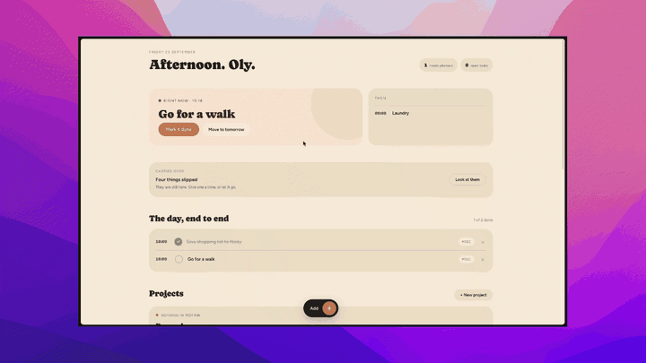
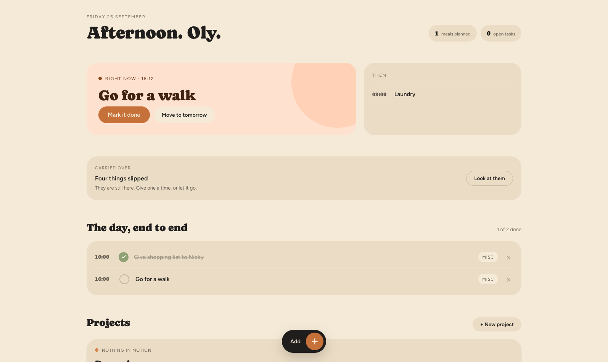
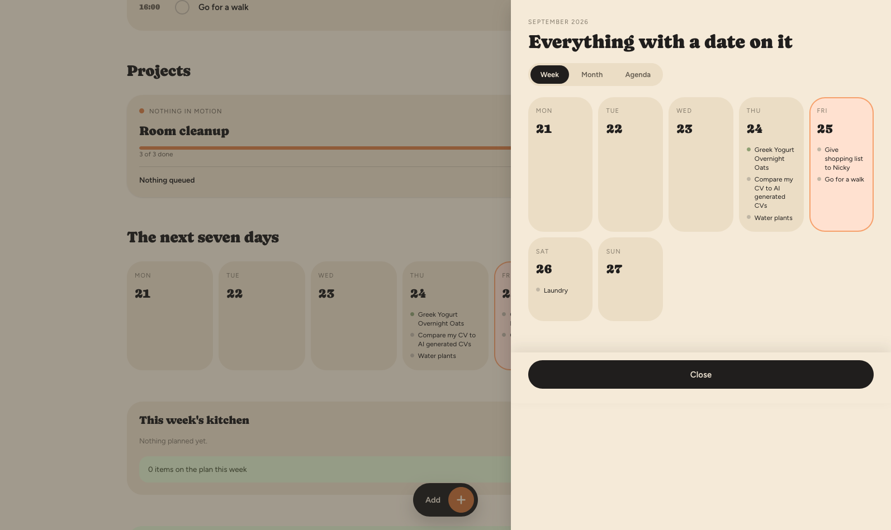
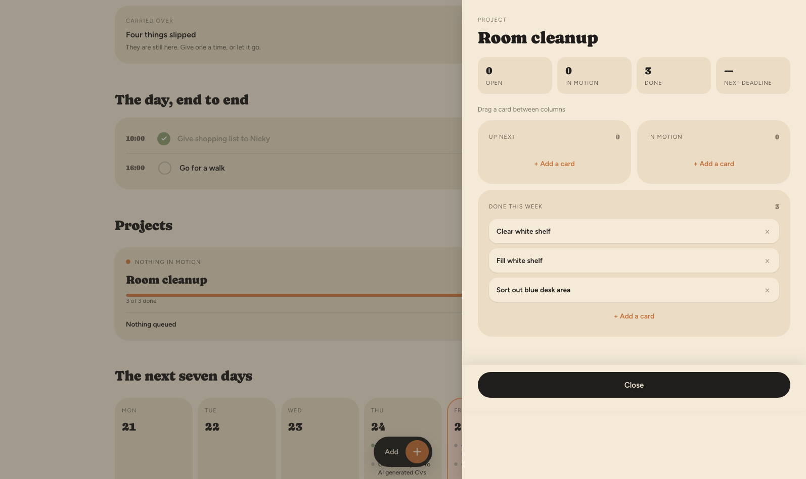
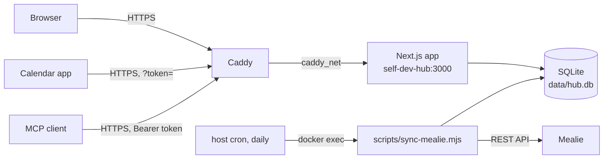

# Self-Dev Hub

A single-user dashboard for planning my days. It keeps projects and day-to-day items in SQLite, pulls planned meals from my self-hosted [Mealie](https://mealie.io) instance, publishes everything that's still open as a private calendar feed, and exposes the same data to AI assistants through an MCP endpoint. It runs as a Docker container on my home server behind Caddy (setup in [homelab](https://github.com/Olys6/homelab)).

After moving to Switzerland I struggled to get back into a rhythm, especially with cooking. I built Self-Dev Hub to give my days some structure: it pulls my meal plan from Mealie, reminds me what to cook and when, keeps small projects moving, and keeps a record of what actually got done, not just what was planned.



| Today | Calendar | Project board |
|---|---|---|
|  |  |  |

## What it does

- **Dashboard.** Shows the next upcoming item, a timeline for today, overdue ("slipped") items, active projects and the next seven days.
- **Items.** Each item has a kind (`cook`, `project`, `misc`, and `gym`, which is currently turned off by a feature flag in `src/lib/config.ts`), a date and an optional time. There's a quick-add modal for creating them.
- **Projects.** Kanban boards with `next / doing / done` columns and an optional target date.
- **Calendar panel.** Week, month and agenda views of everything that has a date.
- **Record.** Weekly counts of completed items per kind over the last 15 weeks.
- **Mealie sync.** `scripts/sync-mealie.mjs` pulls today plus the next 13 days of the Mealie meal plan and replaces the `cook` items in that range. Breakfast, lunch and dinner get default times (08:00, 12:30, 19:00). On my server a cron job runs it daily.
- **Calendar feed.** The app publishes open tasks as an ICS feed at `/api/calendar.ics` (iCalendar, RFC 5545). A token is required as `?token=...`. Timed items become 30-minute events and untimed items become all-day events. I subscribe to the feed in Google Calendar, so my open tasks show up there and on my Pebble watch.
- **MCP endpoint.** `POST /api/mcp` exposes 14 tools over Streamable HTTP. Five read (`get_dashboard`, `list_projects`, `get_project_board`, `list_items`, `get_meal_plan`) and nine write (create, move, reschedule, rename, toggle and delete projects and items). It's stateless and authenticated with a bearer token.
- **Auth.** A single shared password on `/login` gets you an HMAC-signed session cookie that lasts 30 days. The MCP and ICS routes skip the login and check their own tokens instead.

## Architecture



The Docker image uses Next.js `standalone` output. The two scripts in `scripts/` use only `better-sqlite3` and native `fetch`, because Drizzle gets bundled into the server build and can't be imported from a plain script there. `scripts/migrate.mjs` applies the SQL files in `drizzle/` every time the container starts. More detail is in [NOTES.md](NOTES.md).

## Stack

- Next.js 16 (App Router, server actions), React 19, TypeScript
- SQLite via `better-sqlite3`, with Drizzle ORM and drizzle-kit for the schema and generating migrations
- `@modelcontextprotocol/sdk` for the MCP server, `zod` for tool input schemas
- Docker (`node:22-bookworm-slim`, multi-stage build), with Caddy as the reverse proxy

## Running it

### Local development

```bash
npm install
cp .env.example .env.local   # fill in values
npm run db:push              # create data/hub.db from the schema
npm run db:seed              # optional: demo data
npm run dev                  # http://localhost:3000
```

### Docker

```bash
cp .env.example .env         # fill in values
docker network create caddy_net   # once; shared with the reverse proxy
docker compose up -d --build
```

The compose file doesn't publish a port, because Caddy reaches the container by name on `caddy_net`. To run it without Caddy, add `ports: ["3000:3000"]`. The Caddy config and the rest of the server setup are in [homelab](https://github.com/Olys6/homelab).

Daily Mealie sync from the host's crontab:

```cron
0 5 * * * docker exec self-dev-hub node scripts/sync-mealie.mjs >> /path/to/sync.log 2>&1
```

### Connecting an MCP client

```bash
claude mcp add --transport http self-dev-hub https://<your-host>/api/mcp \
  --header "Authorization: Bearer <MCP_API_TOKEN>"
```
